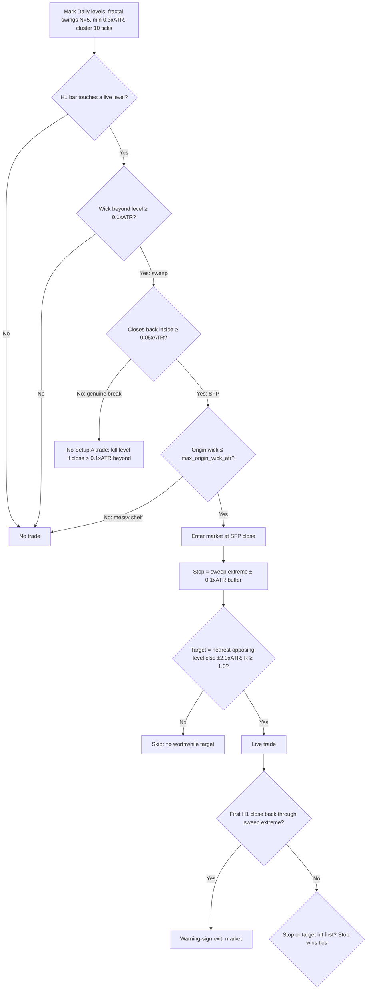

# Strategy — Setup A: Swing Failure Pattern (SFP)

> The only setup in scope. Exhaustive spec for implementation. Philosophy/why lives in `philosophy.md`. All numbers marked `(tunable)` live in `config.yaml`, never in code.

## 0. One sentence
Fade the first clean failed break of an obvious swing level: wick beyond, body closes back inside → enter the rejection, stop beyond the sweep + ATR buffer, target the next opposing level.

## 1. Scope
- **In:** H1 SFP trigger off Daily (optionally higher-timeframe) swing levels. Longs and shorts, mirror logic. FX majors + metals/oil per universe; same rules everywhere.
- **Out (parked):** Setup B touch-grading + confirmations (daily bias / fib / ATR-stretch gates), MACD divergence, limit-at-level orders, gaps, correlations/news, scaling. None of that may gate or trigger a Setup A signal.
- **Timeframes:** Daily (or HTF) defines levels + targets. H1 defines the SFP candle, entry, stop. 5m refinement is an optional experiment (Phase 7), not part of the base spec.

## 2. Definitions (all outputs at bar `t` use data ≤ `t`; ATR thresholds at `t` use ATR through `t−1`)
- **Swing high/low `(tunable: swing_lookback N=5)`:** bar `t` is a swing high iff its high is strictly greater than the highs of the N bars on each side (mirror for lows). Swings smaller than `min_swing_magnitude_atr = 0.3 × ATR(14)` are noise and discarded.
- **Level:** swing prices within `cluster_ticks = 10 ticks` merge into one level at their mean. A level is known only from its confirmation bar onward (forming bar + N). No lookahead.
- **Sweep:** a closed H1 bar whose wick trades beyond the level (high > level for shorts, low < level for longs) by at least `wick_atr = 0.1 × ATR`.
- **SFP confirm (the close):** the same bar closes back inside by at least `close_inside_atr = 0.05 × ATR` (close < level for shorts, close > level for longs). Wick without this close = NOT an SFP = no trade, full stop.
- **Original-wick filter:** the swing that created the level must not have a "very long" wick → `max_origin_wick_atr (tunable, start 1.0 × ATR)`, measured in **daily ATR at formation** (same timeframe as the swing — hourly ATR would mis-scale it). Blown-out origin = messy shelf = skip.
- **Break (level death):** a close beyond the level by more than `touch_tolerance_atr = 0.1 × ATR` that is NOT an SFP close deactivates the level for Setup A. (We fade the first clean failure, not a level being chewed through.)
- **ATR:** Wilder ATR(14) on the trigger timeframe, read through the prior bar so a violent bar never sets its own hurdle.

## 3. Setup A rules, step by step
1. **Mark levels** on Daily per §2 (top-down: HTF zones first, obvious shelves only — equal highs/lows, prior day/session extremes preferred).
2. **Wait** for an H1 bar to interact with a live level. Ignore mid-range bars entirely.
3. **Sweep check:** wick beyond level ≥ `wick_atr`. No → no trade.
4. **Close check:** closes back inside ≥ `close_inside_atr`. No → genuine break, no trade (leave it for Setup B, which is parked).
5. **Origin-wick filter:** origin wick ≤ `max_origin_wick_atr`. Fail → skip.
6. **Enter:** market order (systematic proxy for "on the close") at the SFP close. One position at a time; no pyramiding.
7. **Stop:** beyond the sweep extreme + buffer: short `stop = sweep_high + stop_buffer_atr (0.1 × ATR)`; long `stop = sweep_low − stop_buffer_atr`. (Dante's text: "wick ± ATR" — buffer multiple is the tunable formalization.)
8. **Target:** nearest opposing level from the same detection (resistance above for longs, support below for shorts). None within reason → `entry ± fta_fallback_atr (2.0 × ATR)`. Daily structure may extend the target while entry/stop stay on H1 (explicit experiment flag, not default).
9. **Min-R filter:** skip the trade if `(target − entry) < min_reward_risk (1.0) × (entry − stop)` (mirror for shorts). No defined, worthwhile target = no trade.
10. **Warning-sign exit:** after entry, if price builds a shelf against you and prints the first H1 close back through the sweep extreme (above sweep high for shorts, below sweep low for longs), exit market immediately. This is the Dante "get out" rule — it replaces hoping.

## 4. Worked examples (ATR = 0.0040, i.e. 40 pips on EUR_USD)
- **Bearish:** level 1.1000. H1 bar highs 1.1010 (wick 0.0010 = 0.25×ATR ✓), closes 1.0995 (0.0005 inside = 0.125×ATR ✓). Enter short 1.0995. Stop 1.1010 + 0.0004 = 1.1014 (risk 19 pips). Nearest support 1.0960 → reward 35 pips → R ≈ 1.8 ✓ take.
- **Bullish:** level 1.0850. Bar lows 1.0842 (0.20×ATR ✓), closes 1.0854 (0.10×ATR ✓). Enter long 1.0854. Stop 1.0842 − 0.0004 = 1.0838 (risk 16 pips). Nearest resistance 1.0880 → reward 26 pips → R ≈ 1.6 ✓ take.
- **Rejects:** wick 0.0002 (0.05×ATR, too shallow) → no sweep, no trade. Close exactly at level (0 inside) → no confirm, no trade. Origin swing wick 0.0060 (1.5×ATR, messy) → skip. R = 0.7 → skip.

## 5. Flowchart

## 6. Why it should work / when it dies
- **Edge logic:** obvious levels hold resting stops + breakout orders (liquidity). The sweep fills institutional size against that pool; the close back inside traps the chasers, whose forced exits fuel the reversal. Tight invalidation (sweep extreme) vs whole-range target = asymmetric R.
- **Dies when:** level is obscure (no pool), shelf already chewed (late failure), origin wick huge (no consensus level), trading into HTF trend without room to opposing level (R < 1), entering mid-wick before close (fades genuine breaks), holding past the warning-sign close.

## 7. Parameters (all in `config.yaml`)
| # | Name | Start | Dante-given? | Notes |
|---|------|-------|--------------|-------|
| 1 | swing_lookback N | 5 | No — our choice | fractal window each side |
| 2 | min_swing_magnitude_atr | 0.3 | No | noise floor |
| 3 | cluster_ticks | 10 | No | merge distance, tick_size per pair |
| 4 | wick_atr | 0.1 | Concept yes, number no | min sweep beyond level |
| 5 | close_inside_atr | 0.05 | Concept yes, number no | min close back inside |
| 6 | max_origin_wick_atr | 1.0 | Concept yes ("very long"), number no | new vs old plan |
| 7 | touch_tolerance_atr (break) | 0.1 | No | level-death threshold |
| 8 | stop_buffer_atr | 0.1 | Concept yes ("±ATR"), number no | beyond sweep extreme |
| 9 | fta_fallback_atr | 2.0 | Concept yes (prior high/low zone), number no | no-opposing-level fallback |
| 10 | min_reward_risk | 1.0 | Yes-ish ("worthwhile target") | hard skip filter |
| 11 | risk_per_trade_pct | 1.0 | Yes (fixed-fractional) | sizing; one position at a time |
| 12 | spread/slippage pips | 1.0 / 0.5 | No | costs, always on |

## 8. Explicitly NOT Setup A (do not add without a spec change)
Touch counts, retest counts, confluence gates (D1 bias / fib / ATR-stretch), MACD divergence, limit-at-level entries, gap rules, multi-confirmation AND-trees. The old codebase's `decision_tree` + `confluence/` + `macd_divergence` path is trial scaffold — it does not define Setup A and must not gate it.

## 9. Open experiments (in order, each judged OOS — never in-sample)
1. `max_origin_wick_atr` sweep (0.5 / 1.0 / 1.5 / off) — does the messy-shelf filter earn its keep?
2. 5m entry refinement after H1 SFP (Dante's tip) vs market-on-H1-close.
3. Daily-extended targets vs nearest-level-only (same H1 stop).
4. wick/close/stop-buffer fractions joint sensitivity (hills, not spikes).
5. Session filter (London/NY only?) — only if SFP base is stable first.
